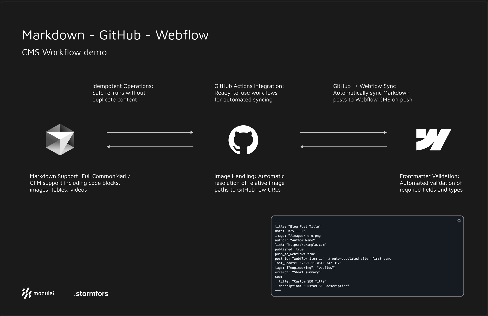

# Webflow CMS ↔ GitHub Two-Way Sync

[](https://github.com/stormfors-webmaster/modulai-demo/actions/workflows/sync-to-webflow.yml)
[](https://github.com/stormfors-webmaster/modulai-demo/actions/workflows/lint-frontmatter.yml)

A two-way synchronization system between GitHub repositories and Webflow CMS for blog content. Developers author posts in Markdown, commit to GitHub, and the system automatically syncs them to Webflow CMS. Optional bidirectional sync allows Webflow edits to flow back to GitHub.



## Features

- **GitHub → Webflow Sync**: Automatically sync Markdown posts to Webflow CMS on push
- **Webflow → GitHub Sync**: Optional bidirectional sync for marketing team edits
- **Markdown Support**: Full CommonMark/GFM support including code blocks, images, tables, videos
- **Frontmatter Validation**: Automated validation of required fields and types
- **Image Handling**: Automatic resolution of relative image paths to GitHub raw URLs
- **Idempotent Operations**: Safe re-runs without duplicate content
- **GitHub Actions Integration**: Ready-to-use workflows for automated syncing

## Architecture

```
GitHub Push → GitHub Webhook/Action → Middleware/Direct API → Webflow CMS
Webflow Edit → Webflow Webhook → Middleware → GitHub (PR/Commit)
```

Two implementation approaches:
1. **Middleware**: Custom service handling webhooks and sync logic
2. **Direct API**: GitHub Actions directly calling Webflow CMS API

## Repository Structure

```
/posts
  ├── post1.md
  ├── post2.md
/images
  ├── image.png
/tools
  ├── sync-webflow.js
  ├── validate-frontmatter.js
  └── package.json
.github/workflows
  ├── sync-to-webflow.yml
  ├── lint-frontmatter.yml
  └── writeback-post-id.yml
```

## Markdown Frontmatter

Posts require frontmatter with the following structure:

```yaml
---
title: "Blog Post Title"
date: 2025-11-06
image: "/images/hero.png"
author: "Author Name"
link: "https://example.com"
published: true
push_to_webflow: true
post_id: "webflow_item_id"  # Auto-populated after first sync
last_update: "2025-11-06T09:42:31Z"
tags: ["engineering", "webflow"]
excerpt: "Short summary"
seo:
  title: "Custom SEO Title"
  description: "Custom SEO description"
---
```

### Required Fields
- `title`: Post title (3-120 chars)
- `date`: ISO 8601 date (YYYY-MM-DD or full timestamp)
- `push_to_webflow`: Boolean flag to enable/disable sync

### Optional Fields
- `slug`: URL slug (auto-generated from title if omitted)
- `image`: Main image URL or relative path
- `author`: Author name
- `link`: External URL
- `published`: Boolean publish flag
- `post_id`: Webflow item ID (populated after first create)
- `last_update`: ISO timestamp for conflict detection
- `tags`: Array of tag strings
- `excerpt`: Short description
- `seo.title`: SEO title override
- `seo.description`: SEO description override

## Field Mappings

| GitHub Frontmatter | Webflow Field | Type | Direction |
|-------------------|---------------|------|-----------|
| `title` | `name` | Plain text | ↔ |
| `slug` (derived) | `slug` | Slug | ↔ |
| Markdown body | `body_rich` | Rich Text | ↔ |
| `image` | `main_image` | Image | ↔ |
| `date` | `publish_date` | Date/Time | ↔ |
| `author` | `author_text` | Plain text | ↔ |
| `link` | `external_link` | URL | ↔ |
| `published` | `is_published` | Switch | ↔ |
| `push_to_webflow` | `push_to_webflow` | Switch | GH→WF only |
| `post_id` | `post_id` | Plain text | ↔ |
| `last_update` | `lastUpdated` (system) | Date/Time (read-only) | Read from API |
| `tags` | `tags` | Plain text (comma-separated) | ↔ |
| `excerpt` | `excerpt` | Plain text | ↔ |
| `seo.title` | `seo_title` | Plain text | ↔ |
| `seo.description` | `seo_description` | Plain text | ↔ |

**Note:** `createdOn` and `lastUpdated` are Webflow system fields that are automatically managed. They cannot be synced but are available in API responses.

## Setup

### Prerequisites

- Node.js 20+
- GitHub repository with blog posts in `/posts`
- Webflow CMS collection configured with matching fields
- Webflow API token

### Installation

1. **Install dependencies**:
```bash
cd tools
npm init -y
npm install gray-matter unified remark-parse remark-gfm remark-rehype rehype-stringify rehype-sanitize
```

2. **Configure environment variables** (GitHub Secrets):
   - `WEBFLOW_TOKEN`: Webflow CMS API token
   - `WEBFLOW_SITE_ID`: Webflow site ID
   - `WEBFLOW_COLLECTION_ID`: Webflow collection ID

3. **Set up GitHub Actions workflows**:
   - Copy workflows from `.github/workflows/` (see [GitHub Actions docs](docs/github_actions_YAML.md))
   - Configure secrets in repository settings

## Local Development

### Quick Start

```bash
# 1. Install dependencies
cd tools && npm ci

# 2. Create environment file
cp .env.example .env.local

# 3. Edit .env.local with your credentials
# WEBFLOW_TOKEN=your_64_char_hex_token
# WEBFLOW_COLLECTION_ID=your_24_char_hex_id
```

### Environment Variables

Create a `.env.local` file in the repository root (or export these variables):

| Variable | Required | Format | Description |
|----------|----------|--------|-------------|
| `WEBFLOW_TOKEN` | Yes | 64 hex chars | Webflow CMS API token |
| `WEBFLOW_COLLECTION_ID` | Yes | 24 hex chars | Webflow collection ID |
| `WEBFLOW_SITE_ID` | No | 24 hex chars | Webflow site ID (for reference) |
| `LOG_LEVEL` | No | `debug\|info\|warn\|error` | Log verbosity (default: `info`) |
| `LOG_FORMAT` | No | `json\|text` | Output format (default: `text`) |

### NPM Scripts

Run all commands from the `/tools` directory:

```bash
cd tools

# Syncing
npm run sync              # Sync changed posts only
npm run sync:all          # Sync all posts to Webflow
npm run sync:dry          # Dry run (preview without making changes)

# Validation
npm run validate          # Validate all posts frontmatter

# Code Quality
npm run lint              # Check code with Biome linter
npm run lint:fix          # Auto-fix linting issues
npm run format            # Format code with Biome

# Testing
npm test                  # Run unit tests once
npm test:watch            # Run tests in watch mode
```

### Running Scripts Directly

You can also run the tools directly with Node.js:

```bash
# Sync scripts
node tools/sync-webflow.js                    # Sync changed files
node tools/sync-webflow.js --all              # Sync all posts
node tools/sync-webflow.js --dry-run          # Preview changes
node tools/sync-webflow.js --all --dry-run    # Preview all posts

# Validation
node tools/validate-frontmatter.js            # Validate posts/*.md

# Utility scripts
node tools/fetch-schema.js                    # Inspect Webflow collection schema
node tools/create-fields.js                   # Create missing Webflow fields
node tools/inspect-items.js                   # View existing Webflow items
```

### Utility Tools

**`fetch-schema.js`** - Inspect your Webflow collection structure:
```bash
node tools/fetch-schema.js
# Outputs: Field IDs, types, requirements
# Useful for verifying field mappings
```

**`create-fields.js`** - Programmatically create missing Webflow fields:
```bash
node tools/create-fields.js
# Creates: publish-date, is-published, push-to-webflow, post-id, etc.
# Skips fields that already exist
```

**`inspect-items.js`** - View existing collection items:
```bash
node tools/inspect-items.js
# Useful for debugging sync issues
```

### Testing Locally

```bash
cd tools

# Run all tests
npm test

# Run tests in watch mode (re-runs on file changes)
npm test:watch

# Run specific test file
node --test test/unit/sync-webflow.test.js
node --test test/unit/validators.test.js
```

## Usage

### Manual Sync

Sync all posts:
```bash
node tools/sync-webflow.js --all
```

Sync changed posts only:
```bash
node tools/sync-webflow.js
```

Dry run (no writes):
```bash
node tools/sync-webflow.js --dry-run --all
```

### Validate Frontmatter

```bash
node tools/validate-frontmatter.js
```

### Automated Sync

- **On Push**: Automatically syncs changed posts when pushed to main branch
- **On PR**: Validates frontmatter schema
- **Manual**: Trigger via GitHub Actions UI

## Configuration

### Webflow Collection Setup

Create a CMS collection in Webflow with these fields:

1. **Name** (`name`) - System field
2. **Slug** (`slug`) - System field
3. **Body** (`post-body`) - Rich Text
4. **Main Image** (`main-image`) - Image
5. **Publish Date** (`publish-date`) - Date/Time
6. **Author** (`author`) - Plain text (or Reference to Authors collection)
7. **External Link** (`link`) - Link
8. **Is Published** (`is-published`) - Switch
9. **Push to Webflow** (`push-to-webflow`) - Switch
10. **Post ID** (`post-id`) - Plain text
11. **Tags** (`tags`) - Plain text (comma-separated)
12. **Excerpt** (`post-summary`) - Plain text
13. **SEO Title** (`seo-title`) - Plain text
14. **SEO Description** (`seo-description`) - Plain text

**System Fields (Automatic):**
- `createdOn` - Automatically set on creation (read-only)
- `lastUpdated` - Automatically updated on modification (read-only)
- `lastPublished` - Set when published (read-only)

### Field API IDs

Ensure Webflow field API IDs match the mapping configuration. Use lowercase with underscores (e.g., `body_rich`, `main_image`).

## Image Handling

- **Relative paths**: `/images/image.png` → Resolved to GitHub raw URL
- **Absolute URLs**: Passed through as-is
- **Optional upload**: Middleware can upload to Webflow Assets CDN

Images are resolved to commit-pinned raw GitHub URLs for immutability:
```
https://raw.githubusercontent.com/owner/repo/COMMIT_SHA/images/image.png
```

## Markdown Conversion

- **Markdown → HTML**: Uses remark/rehype with GFM support
- **HTML → Markdown**: Uses turndown/html2text (for bidirectional sync)
- **Supported elements**: Headings, lists, blockquotes, code blocks, tables, images, links, videos

Code blocks preserve language classes:
```markdown
```python
code here
```
```
→
```html
<pre><code class="language-python">code here</code></pre>
```

## Dependencies

The sync tools use the following npm packages for processing Markdown:

### Core Parser
- **`gray-matter`** (^4.0.3) - Extracts and parses YAML frontmatter from Markdown files

### Markdown Processing Pipeline (unified ecosystem)
- **`unified`** (^11.0.0) - Text processing orchestrator that chains transformations
- **`remark-parse`** (^11.0.0) - Converts Markdown text to syntax tree (AST)
- **`remark-gfm`** (^4.0.0) - Adds GitHub Flavored Markdown support (tables, task lists, strikethrough)
- **`remark-rehype`** (^11.0.0) - Converts Markdown tree to HTML tree
- **`rehype-sanitize`** (^6.0.0) - Sanitizes HTML output, removing dangerous elements
- **`rehype-stringify`** (^10.0.0) - Converts HTML tree to HTML string

### Processing Flow
```
Markdown file
    ↓
gray-matter → Extracts frontmatter + content
    ↓
remark-parse → Markdown text to syntax tree
    ↓
remark-gfm → Adds GitHub markdown features
    ↓
remark-rehype → Markdown tree to HTML tree
    ↓
rehype-sanitize → Removes unsafe HTML
    ↓
rehype-stringify → Syntax tree to HTML string
    ↓
Webflow API → Publishes clean HTML
```

## GitHub Actions Workflows

### Sync on Push
- Triggers on push to main branch
- Syncs changed Markdown files
- See `.github/workflows/sync-to-webflow.yml`

### Frontmatter Validation
- Runs on PRs affecting `/posts/**/*.md`
- Validates required fields and types
- See `.github/workflows/lint-frontmatter.yml`

### Writeback Post ID
- Updates frontmatter with Webflow item ID after creation
- Triggered via `repository_dispatch` event
- See `.github/workflows/writeback-post-id.yml`

### Resync All
- Manual workflow to resync all posts
- Supports dry-run mode via input parameter
- See `.github/workflows/resync-all.yml`

See [GitHub Actions documentation](docs/github_actions_YAML.md) for complete workflow templates.

## Logging & Debugging

### Log Levels

Control log verbosity via the `LOG_LEVEL` environment variable:

| Level | Description | Use Case |
|-------|-------------|----------|
| `debug` | Detailed execution info | Development, troubleshooting |
| `info` | Normal operation flow | Default, production |
| `warn` | Non-fatal issues | Monitoring |
| `error` | Failures only | Minimal output |

```bash
# Local development with verbose logging
LOG_LEVEL=debug node tools/sync-webflow.js --all

# Quiet mode (errors only)
LOG_LEVEL=error node tools/sync-webflow.js --all
```

### Log Format

Control output format via `LOG_FORMAT`:

```bash
# Human-readable (default for local)
LOG_FORMAT=text node tools/sync-webflow.js

# Structured JSON (default in CI, useful for log aggregation)
LOG_FORMAT=json node tools/sync-webflow.js
```

### Correlation IDs

Every sync operation generates a correlation ID for tracing:

- **In GitHub Actions**: Auto-generated as `{run_id}-{run_attempt}` (e.g., `12345678-1`)
- **Locally**: Set via `CORRELATION_ID` env var or auto-generated

```bash
# Set custom correlation ID for tracing
CORRELATION_ID=debug-session-001 node tools/sync-webflow.js --all
```

All log entries include the correlation ID for filtering related operations.

### GitHub Actions Logging

#### Viewing Workflow Logs

1. **GitHub UI**: Navigate to Actions tab → Select workflow run → View job logs
2. **GitHub CLI**:
   ```bash
   # List recent workflow runs
   gh run list --workflow=sync-to-webflow.yml

   # View logs for a specific run
   gh run view <run-id> --log

   # Watch a running workflow
   gh run watch <run-id>

   # Download logs for offline analysis
   gh run download <run-id> --name=logs
   ```

#### Workflow Run Summary

Each sync workflow generates a summary table in the Actions UI:

| Field | Description |
|-------|-------------|
| Run ID | GitHub Actions run identifier |
| Correlation ID | Trace ID for log filtering |
| Status | Success/failure |
| Branch | Source branch |
| Commit | Triggering commit SHA |

#### Adding Custom Logging to Workflows

Use GitHub Actions workflow commands for enhanced logging:

```yaml
# Group related logs
- name: Sync to Webflow
  run: |
    echo "::group::Sync Operation"
    node tools/sync-webflow.js --all
    echo "::endgroup::"

# Add warning annotations
- run: echo "::warning::Rate limit approaching"

# Add error annotations
- run: echo "::error file=posts/example.md,line=5::Invalid frontmatter"

# Set output for subsequent steps
- run: echo "synced_count=5" >> $GITHUB_OUTPUT

# Mask sensitive data
- run: echo "::add-mask::${{ secrets.WEBFLOW_TOKEN }}"
```

#### Debug Mode

Enable verbose GitHub Actions logging by setting repository secrets:

1. Go to **Settings** → **Secrets and variables** → **Actions**
2. Add secret: `ACTIONS_RUNNER_DEBUG` = `true`
3. Add secret: `ACTIONS_STEP_DEBUG` = `true`

This enables detailed runner and step-level logging for all workflow runs.

#### Log Retention

- Default retention: 90 days
- Configure in repository settings or per-workflow:
  ```yaml
  jobs:
    sync:
      runs-on: ubuntu-latest
      steps:
        - uses: actions/upload-artifact@v4
          with:
            name: sync-logs
            path: logs/
            retention-days: 30
  ```

### Audit Logging

The sync tool includes built-in audit logging:

```bash
# Audit log output example
[AUDIT] Operation: sync
[AUDIT] File: posts/my-post.md
[AUDIT] Action: UPDATE
[AUDIT] Duration: 1.2s
[AUDIT] Status: SUCCESS

# Summary at end of run
[AUDIT] Summary: 5 successful, 0 failed, 2 skipped
```

### Troubleshooting

**Sync fails with "Rate limit exceeded"**:
```bash
# Wait and retry, or check current rate limit status
LOG_LEVEL=debug node tools/sync-webflow.js --dry-run
```

**Build fails in GitHub Actions**:
```bash
# Check build status and errors
gh run view <run-id> --log-failed

# Re-run failed jobs
gh run rerun <run-id> --failed
```

**Verify Webflow connection**:
```bash
# Test API access and view collection schema
node tools/fetch-schema.js
```

**Debug specific post sync issues**:
```bash
# Run with debug logging
LOG_LEVEL=debug node tools/sync-webflow.js --all 2>&1 | grep "my-post"
```

## Production Features

- ✅ **Retry Logic**: Automatic retry with exponential backoff for API failures
- ✅ **Rate Limiting**: Respects Webflow API limits (120 requests/minute)
- ✅ **Error Handling**: Comprehensive error handling with detailed logging
- ✅ **Security**: Secrets are masked in logs, no hardcoded credentials
- ✅ **Reliability**: Option B file detection for robust change tracking
- ✅ **Monitoring**: GitHub Actions badges and workflow status tracking

## Production Checklist

Before deploying to production:

- [x] ✅ Test posts archived/removed
- [x] ✅ Retry logic implemented
- [x] ✅ Rate limiting implemented
- [x] ✅ Secrets properly configured
- [x] ✅ Workflow badges added
- [ ] ⚠️ Set up error notifications (email/Slack)
- [ ] ⚠️ Monitor first few syncs for issues
- [ ] ⚠️ Review Webflow collection field mappings

### Middleware Approach

For production deployments, consider the middleware approach:
- Handles webhooks from both GitHub and Webflow
- Provides conflict resolution and state management
- Supports multiple projects and collections
- See [Middleware Specification](docs/middleware_spec.md)

### Testing

1. **Unit tests**: Frontmatter parsing, MD↔HTML conversion, image resolution
2. **Integration tests**: Mock GitHub/Webflow APIs, end-to-end sync flows
3. **E2E tests**: Full round-trip sync with real APIs (staging)

### Error Handling

- **Validation errors**: Fail fast with clear error messages
- **API errors**: Retry with exponential backoff (3 attempts)
- **Rate limits**: Respect GitHub/Webflow rate limits with queuing

## Documentation

- [Product Requirements Document](docs/PRD.md)
- [Middleware Specification](docs/middleware_spec.md)
- [Sync Implementation Guide](docs/sync_webflow.md)
- [Frontmatter Validation](docs/validate_frontmatter.md)
- [Field Mappings](docs/webflow_field_mappings.md)
- [GitHub Actions Workflows](docs/github_actions_YAML.md)

## License

[Add your license here]
